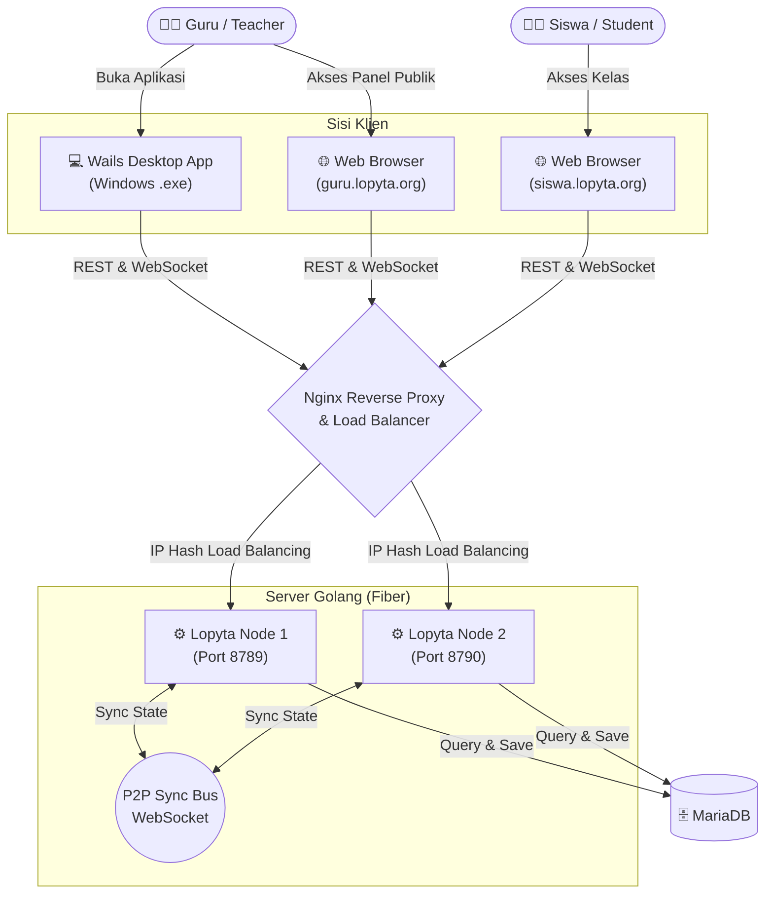

# Lopyta Classroom (Bringgas PDI)

Aplikasi manajemen kelas interaktif hybrid yang menggabungkan kemampuan **Desktop App (Wails)** untuk guru dengan **Web App** untuk siswa. Dirancang untuk dapat berjalan sebagai jembatan antara aplikasi desktop offline dan sinkronisasi server terpusat.

---

## 🏗️ Flowchart Arsitektur Sistem

Berikut adalah alur kerja dan arsitektur dari sistem Lopyta:



---

## 📁 Struktur Direktori & Program

Sistem ini memadukan **Golang** sebagai bahasa *backend* dan **React + TypeScript** sebagai antarmuka pengguna (*frontend*).

### 1. Root & Konfigurasi Utama
- `go.mod` & `go.sum`: Konfigurasi *dependency* (modul) Golang yang digunakan (Fiber, Wails, Gorilla WebSocket, dll).
- `main.go`: File pusat aplikasi Golang. Berisi inisialisasi server **Fiber**, registrasi *middleware* (CORS, Logger), koneksi ke *database*, *state manager*, dan titik masuk (entry point) aplikasi Wails. Seluruh routing utama dan sinkronisasi P2P antar-node juga diinisialisasi di sini.
- `routes.go`: Pemisahan _routing_ REST API tambahan (contohnya Question Bank Sets) agar `main.go` tidak terlalu panjang.
- `app.go`: Siklus hidup (lifecycle) dari aplikasi Wails desktop. Mengontrol *startup*, *shutdown*, dan interaksi _bridge_ khusus dengan sistem operasi klien.
- `wails.json`: File konfigurasi *build* untuk framework Wails (nama aplikasi, output, perintah build).
- `pull.sh`: *Shell script* otomatis untuk menarik pembaruan dari GitHub, melakukan kompilasi *frontend* dan *backend*, hingga memuat ulang (*restart*) layanan VPS.

### 2. `/frontend` (Antarmuka Pengguna)
Aplikasi _Single Page Application_ (SPA) berbasis **React**, **Vite**, dan **TailwindCSS**.
- `index.html` & `vite.config.ts`: Entry point Vite.
- `src/App.tsx`: Routing halaman antarmuka (Login, Host/Teacher Dashboard, Public Landing Page, Layar Siswa).
- `src/components/`: Komponen React terpisah (UI modular). Terdapat sub-folder seperti `classroom/` untuk komponen panel kelas, Bank Soal, dll.
- `src/store/`: State management di sisi frontend menggunakan **Zustand** (contoh: `classStore.ts` untuk REST API, `websocketStore.ts` untuk sinkronisasi Real-Time).

### 3. `/classroom` (Logika Inti / State Manager)
Paket Golang yang mengatur *business logic* kelas secara **Real-Time**.
- `state.go`: Mengatur memori kelas yang sedang aktif (Active Classes), menyimpan data siswa yang terhubung, dan skor.
- `websocket.go` & `hub.go`: Logika koneksi WebSocket. Mengelola `Upgrader`, _Broadcast_ pesan ke siswa/guru, serta _Ping/Pong_ untuk mendeteksi klien yang terputus (Disconnect).
- `auth.go`: Logika pembuatan sesi autentikasi dan validasi PIN unik siswa.
- `p2p.go`: Mengatur komunikasi sinkronisasi state antar-node (misal: Lopyta Node-1 dan Node-2) melalui WebSocket khusus server-to-server agar data siswa tetap sinkron meski terhubung di node yang berbeda.

### 4. `/database` (Manajemen Basis Data)
- Berisi file `.sql` (seperti `migration_01.sql`) untuk skema dan struktur tabel database MariaDB. Skema meliputi tabel `teachers`, `classes`, `students`, `question_bank`, `question_sets`, dan `roster`.

### 5. `/nginx` & `/supervisor` (DevOps & Deployment)
- `nginx/lopyta.conf`: Konfigurasi *Reverse Proxy* dan *Load Balancer* Nginx. Mengatur rute HTTPS, pemetaan domain (guru.lopyta.org & siswa.lopyta.org), dan pengaturan khusus WebSocket.
- `supervisor/lopyta.conf`: Konfigurasi untuk aplikasi **Supervisor** yang menjaga proses Golang tetap berjalan (*Daemon*) di VPS, otomatis me-*restart* jika terjadi *crash*, dan menyuntikkan *environment variables* seperti `WAILS_MODE="server"`.

---

## 🛠️ Cara Membangun (Build) & Menjalankan

### A. Sebagai Web Server di VPS (Production)

Saat berjalan di server VPS yang tidak memiliki layar antarmuka (Headless), aplikasi dijalankan dalam mode Web Server murni.

1. **Jalankan Skrip Otomatis**
   Cukup jalankan `pull.sh` untuk melakukan _pull_, kompilasi _frontend_ dan _backend_, serta melakukan _restart_.
   ```bash
   ./pull.sh
   ```

2. **Proses Manual (Jika diperlukan)**
   ```bash
   # Build Frontend
   cd frontend
   npm install && npm run build
   cd ..

   # Build Backend
   go mod tidy
   go build -o lopyta-server .

   # Restart Node (melalui Supervisor)
   sudo supervisorctl restart lopyta-node-1 lopyta-node-2
   ```
   *Catatan Penting*: Server akan gagal berjalan di VPS tanpa variabel `WAILS_MODE="server"` pada environment Supervisor, karena framework Wails secara default akan mencoba membuka UI Desktop.

### B. Sebagai Aplikasi Desktop (Windows/Mac)

Untuk membuat file eksekusi ganda (`.exe` di Windows) yang bertindak sebagai server lokal sekaligus memunculkan UI aplikasi desktop bagi Guru:

```bash
# Pastikan wails CLI sudah terinstall
wails build -clean -o lopyta_guru.exe
```

File hasil *build* akan tersedia di dalam direktori `build/bin/`.

---

## 🌐 Endpoints Utama

- **GET `/`**: Landing Page Publik (Download Aplikasi)
- **GET `/host/*`**: Teacher Dashboard (Membutuhkan Login)
- **GET `/play/*`**: Ruang Kelas Siswa (Membutuhkan PIN / Auth)
- **GET `/ws`**: Koneksi WebSocket Real-Time
- **REST API `/api/*`**: Endpoint untuk mengambil kelas aktif, manipulasi bank soal, dsb.

---

## 🛡️ Teknologi yang Digunakan
- **Backend:** Golang, Fiber (Web Framework), Wails (Desktop Bridge), Gorilla WebSocket.
- **Frontend:** React 18, TypeScript, Vite, Tailwind CSS v3, Zustand, Lucide Icons.
- **Database:** MariaDB / MySQL.
- **Infrastruktur:** Nginx (Load Balancer & SSL Terminator), Supervisor (Process Monitor).
