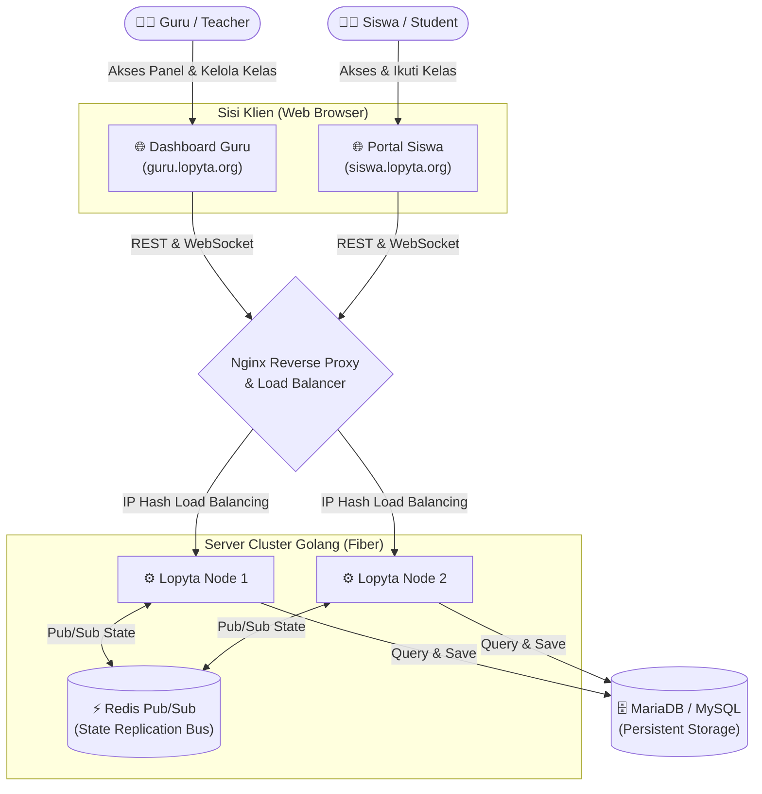

# Bringgas PDI

**Bringgas PDI (Platform Digital Interaktif): Real-Time Interactive Learning & Voice Communication Space** adalah sebuah platform manajemen kelas interaktif dan responsif berbasis web. Aplikasi ini dirancang khusus untuk menciptakan pengalaman pembelajaran yang mulus secara *real-time* (sinkron), menghubungkan Guru sebagai *host* atau presenter, dan Siswa sebagai peserta (partisipan).

Sistem ini dirancang untuk dapat diskalakan (*scalable*) melalui arsitektur berbasis *microservices* (multi-node) dengan memanfaatkan Redis Pub/Sub untuk replikasi *state* (status kelas) dan MariaDB sebagai penyimpanan persisten. 

---

## ✨ Fitur Utama

- **Real-Time Synchronization**: Menggunakan teknologi WebSocket untuk memastikan setiap tindakan (seperti perpindahan slide, pemberian skor, dan interaksi sesi kelas) disinkronkan secara *real-time* ke seluruh perangkat yang terhubung.
- **Distributed Architecture (Clustering)**: Mendukung penggunaan multi-node (contoh: Node-1, Node-2) di belakang *Load Balancer* Nginx. Koneksi dari klien-klien yang berbeda di-*route* secara merata namun tetap dapat berkomunikasi berkat *P2P Sync Bus* dan sinkronisasi *Redis Pub/Sub*.
- **Role-Based Access (Domain Separation)**: 
  - **Guru (Host)**: Mengakses melalui *subdomain* khusus (misal: `guru.lopyta.org`) dengan keamanan login menggunakan Google OAuth 2.0. Guru dapat membuat ruang kelas, membagikan *Access Code* (PIN), mengatur kuis (*Question Banks*), dan memberikan skor.
  - **Siswa (Participant)**: Mengakses melalui *subdomain* khusus (misal: `siswa.lopyta.org`). Tidak perlu login akun, hanya menggunakan *Access Code* 6 digit dan nama panggilan untuk masuk ke kelas yang sedang aktif.
- **Interactive Question Bank**: Guru memiliki panel khusus untuk membuat, menyimpan, dan meluncurkan pertanyaan *live* kepada siswa.

---

## 🏗️ Arsitektur & Flowchart Sistem

Aplikasi ini sepenuhnya berbasis Web (tanpa klien Desktop) untuk memastikan aksesibilitas dari perangkat apapun (PC, Laptop, Tablet, maupun Smartphone).



---

## 📁 Struktur Direktori & Kode Sumber

Sistem memadukan performa tinggi **Golang** sebagai basis mesin *backend* dan keindahan **React + TypeScript** di sisi *frontend*.

### 1. Root & Konfigurasi Inti
- `go.mod` & `go.sum`: Daftar dependensi paket Golang (seperti `gofiber/fiber/v2`, `gofiber/websocket/v2`, dan konektor basis data).
- `main.go`: Titik masuk (*Entry Point*) aplikasi backend Golang. Berfungsi untuk menginisialisasi server Fiber, menghubungkan MariaDB, menginisialisasi replikasi *state* Redis, serta menetapkan *routing* utama HTTP dan *middleware* otorisasi.
- `routes.go`: Menangani manajemen *routing* yang lebih terstruktur (seperti rute REST API tambahan) agar file inti tidak membengkak.
- `.env`: (Hanya di *local*) File variabel *environment* yang mengatur parameter *port*, koneksi *database*, OAuth ID, serta alamat Redis.
- `pull.sh`: Skrip otomatis (*shell script*) untuk CD (*Continuous Deployment*) sederhana di server VPS (menarik *source code*, me-*rebuild* frontend, me-*recompile* backend Golang, dan me-*restart* proses).

### 2. `/frontend` (Antarmuka Pengguna SPA)
Aplikasi dibangun menggunakan model SPA (*Single Page Application*) yang cepat dan modular menggunakan **React 18**, **Vite**, dan **TailwindCSS**.
- `vite.config.ts`: Konfigurasi *bundler* frontend.
- `src/App.tsx`: Sentral *routing* untuk rute *Frontend* menggunakan React Router, memisahkan logika antara halaman *Landing*, Guru (Host Dashboard), dan Siswa (Play/Classroom).
- `src/components/`: Kumpulan komponen visual (UI modular) yang dapat digunakan ulang, dipisahkan berdasarkan domain, seperti komponen *classroom*, *dashboard*, modal keamanan, dan pengaturan.
- `src/store/`: *State Management* frontend yang ditenagai oleh **Zustand**. Termasuk logika untuk `websocketStore.ts` yang menangani koneksi sinkron dengan server Golang, serta *store* tambahan untuk API.

### 3. `/classroom` (Mesin Real-Time & Logika Inti)
Paket (*package*) khusus pada backend yang berfungsi sebagai mesin penggerak komunikasi *real-time*.
- `state.go`: Memori (RAM) penyimpan data sesi kelas, profil siswa sementara, dan skor aktif selama kelas berjalan.
- `websocket.go` & `hub.go`: *Handler* utama untuk *WebSocket Upgrade*. Menangani sistem deteksi koneksi (Ping/Pong), pembersihan sesi *disconnection*, dan *Broadcast* massal kepada seluruh siswa.
- `p2p.go` / `replication.go`: Mengoordinasikan replikasi data ke seluruh Node menggunakan Redis Pub/Sub, sehingga jika Siswa A masuk lewat Node-1 dan Siswa B lewat Node-2, semua data tetap sinkron pada detik yang sama di UI Guru.
- `auth.go`: Logika pembuatan token/sesi, validasi, dan memastikan bahwa pengguna yang masuk memiliki hak istimewa yang tepat.

### 4. `/database`
- Berisi kumpulan *script* SQL untuk mendirikan atau memigrasikan basis data. Tabel yang tercakup meliputi `teachers` (autentikasi guru), `classes` (riwayat kelas), `students` (histori partisipan), `question_bank`, dan relasi relevan lainnya.

### 5. `/nginx` & `/supervisor` (DevOps & Server Management)
- **Nginx (`lopyta.conf`)**: Konfigurasi *Reverse Proxy*. Mengarahkan permintaan berdasarkan *domain* ke *backend*, mendistribusikan *load* secara seimbang (*Load Balancer*), serta melakukan penghentian SSL (*SSL Termination*).
- **Supervisor (`lopyta.conf`)**: Proses manajer (*Daemon*) untuk menjaga *binary* Golang tetap hidup 24/7 di latar belakang. Jika *crash*, akan langsung me-*restart* aplikasi.

---

## 🚀 Panduan Membangun (Build) & Deployment

Aplikasi ini disiapkan untuk berjalan secara optimal di lingkungan produksi (VPS berbasis Linux seperti Ubuntu/Debian).

### 1. Prasyarat Lingkungan
- Node.js (v18+) dan NPM.
- Go (v1.21+).
- MariaDB / MySQL.
- Redis Server (untuk Replikasi dan Penyimpanan Sesi HTTP).

### 2. Konfigurasi `environment`
Buat file `.env` di *root directory* dan sesuaikan dengan contoh konfigurasi berikut:
```env
PORT=8789
NODE_NAME="node-1"
TEACHER_DOMAIN="guru.lopyta.org"
STUDENT_DOMAIN="siswa.lopyta.org"
DB_DSN="user:password@tcp(127.0.0.1:3306)/classroom_bringgas?parseTime=true"
REDIS_ADDR="127.0.0.1:6379"
REDIS_PASSWORD="password_redis"
GOOGLE_CLIENT_ID="id_klien_oauth_anda"
GOOGLE_CLIENT_SECRET="rahasia_oauth_anda"
SESSION_SECRET="kunci_rahasia_aman_anda"
```

### 3. Kompilasi & Build

**A. Sisi Frontend:**
```bash
cd frontend
npm install
npm run build
cd ..
```
Hasil kompilasi Vite akan diletakkan di dalam folder `frontend/dist`. Pada waktu kompilasi (*compile-time*) Golang, folder ini akan dibundel (*embed*) langsung menggunakan `go:embed`.

**B. Sisi Backend (Golang):**
```bash
go mod tidy
go build -o lopyta-server .
```
Menghasilkan *binary file* bernama `lopyta-server`.

### 4. Menjalankan Server
Jalankan file *binary* langsung atau gunakan Supervisor untuk mode layanan permanen:
```bash
./lopyta-server
```
Jika ingin merilis *update*, Anda juga bisa memanfaatkan skrip bantu:
```bash
./pull.sh
```

---

## 📡 Dokumentasi Endpoint REST API

Selain WebSocket (`ws://` atau `wss://`) untuk pertukaran *state* interaktif, Lopyta juga menyediakan sekumpulan *endpoint* REST berbasis HTTP untuk navigasi dan aksi statis:

### Autentikasi & Identitas
- `GET /api/auth/google/login`: Mengarahkan (*Redirect*) ke halaman persetujuan Google OAuth 2.0.
- `GET /api/auth/google/callback`: Menerima kode validasi balik dari Google, meregistrasi akun atau melanjutkan login.
- `GET /api/auth/me`: Mengembalikan *payload* identitas Guru yang sedang aktif masuk.
- `POST /api/auth/logout`: Membunuh *session* dan mengakhiri semua kelas yang terafiliasi dengan Guru tersebut secara otomatis.

### Manajemen Kelas
- `GET /api/teacher/classes`: Mengambil daftar riwayat ruang kelas.
- `POST /api/teacher/classes`: Membuka sesi kelas baru dengan menghasilkan kode akses acak/tertentu.
- `PUT /api/teacher/classes/:code`: Mengubah informasi/nama kelas yang ada.
- `DELETE /api/teacher/classes/:code`: Menghapus riwayat kelas dari *database* secara permanen, beserta seluruh datanya.
- `POST /api/class/start`: Memulai ulang *engine* kelas jika *state* sebelumnya sempat tertidur (*hibernate*).

### Bank Soal (Question Bank)
- `GET /api/bank`: Mengambil daftar koleksi pertanyaan dari bank soal.
- `POST /api/bank`: Menyimpan pertanyaan baru ke bank soal.
- `PUT /api/bank/:id`: Memperbarui *item* bank soal tertentu.
- `DELETE /api/bank/:id`: Menghapus soal dari repositori.

---

## 🛡️ Teknologi Pendukung (Tech Stack)

Sistem Lopyta dioptimasi untuk berjalan dengan latensi sekecil mungkin dan dirancang menggunakan praktik arsitektur modern (*Modern Architecture*):

- **Pemrosesan Backend**: Golang, [Fiber](https://gofiber.io/) (High-Performance HTTP Server).
- **Transport Real-Time**: [Gorilla WebSocket](https://github.com/gorilla/websocket).
- **Frontend & Antarmuka**: React 18, TypeScript, [Vite](https://vitejs.dev/), Tailwind CSS, Zustand (State Manager), Lucide React (Ikon).
- **Basis Data Utama**: MariaDB (Relational Data / Storage).
- **Broker Pesan & Sesi**: Redis (Session Store & Pub/Sub Network).
- **Manajemen Server (DevOps)**: Nginx, Supervisor, Linux Environment.

---
*Dikembangkan secara penuh untuk ekosistem pembelajaran modern.*
